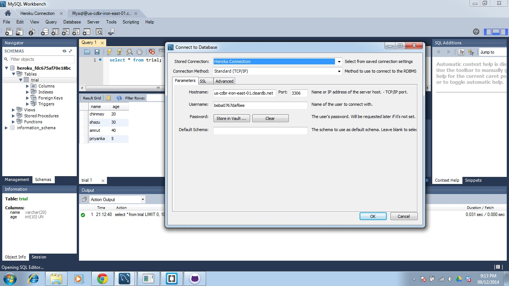
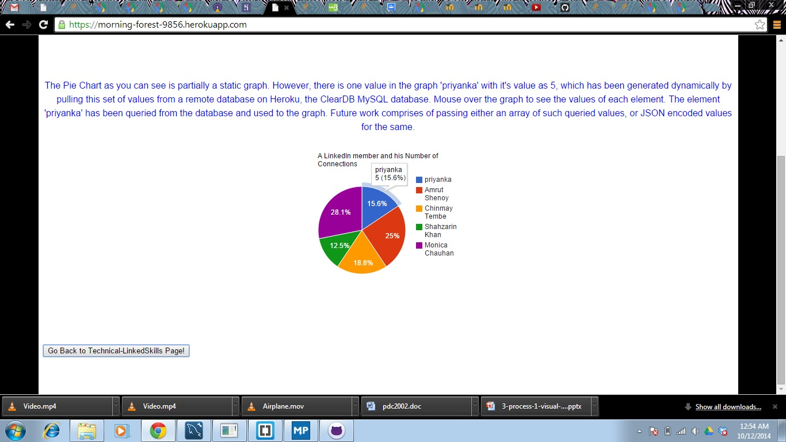

Technical - Linked Skills
======================================================================

Developers
-------------------------
- [x] Gati Shah: 

		Unity ID - gshah
		
		Student ID - 001080029
- [x] Priyanka Shankaran:

		Unity ID - priyan

		Student ID - 200022245

Application
-------------------------

Link: https://still-sea-7195.herokuapp.com

Dynamic graph link: https://morning-forest-9856.herokuapp.com/

Github: https://github.ncsu.edu/CSC510-Fall2014/Technical-LinkedSkills

Trello: https://trello.com/b/Gnhsp8lt/se-final-project-board-priyan-gshah

Video: https://www.youtube.com/watch?v=7SOwI-1imX0&feature=youtu.be

Introduction
-------------------------

Every organization needs a system where they can query and find resource that can fit their requirement. We had developed an application that is one of its kind and can help you to fetch and render the information from Linkedin using a particular keyword. This works just in par as the search tab in the actual Linkedin application but due to the restrictions imposed on the Linkedin developers we cannot render more than 10 search results. Along with the search feature we have also added a feature for better and interactive form of data viewing in the application. This helps render more amount of clear and precise data in a smaller space.

The rendered data can be useful in the following ways:
- [x] Fetch data based on First name, Last name, Location, Headline, Skills listed for the connection or possibly any company he has worked for.
- [x] Navigate to the user's linkedin profile for complete information about the connections fetched.
- [x] We have been able to fetch information from 1st and 2nd degree connections of the user. So if not directly connected, - you will definitely get the data from the connections of your connections giving you a wider scope of search.
- [x] We have graphically displayed the information for you to better and compactly understand the data that we have fetched for you.

We have used the following technologies in order to develop the application:
- [x] Trello: Trello has enabled us to divide the workflow into user-stories and assign into individual team members. It also enables us to assign a due date for the tasks and commment about each of the tasks. It has a very user friendly front - end and provides a list of features that enables to organize your user requirements and divide the workflow. It keeps a check on the deadlines and also keeps you updated through notification. This application has really worked for us to keep us on track with the project development.
- [x] Linkedin API: LinkedIn has created a JS API called Connect to help you get around the authentication and structure, so that you can focus on the logic and presentation of your application without spending too much time considering the back end. The Connect framework does all of the authentication work for you, and loads the things you need in order to get things working in your application.
- [x] Heroku: Heroku is a cloud application platform – a new way of building and deploying web apps. It is used to let app developers spend their time on their application code, not managing servers, deployment, ongoing operations, or scaling.
- [x] D3 Library: D3.js is a JavaScript library that uses digital data to drive the creation and control of dynamic and interactive graphical forms which run in web browsers. Embedded within an HTML webpage, the JavaScript D3.js library uses pre-built JavaScript functions to select elements, create SVG objects, style them, or add transitions, dynamic effects or tooltips to them. These objects can also be widely styled using CSS. Large datasets can be easily bound to SVG objects using simple D3 functions to generate rich text/graphic charts and diagrams. The data can be in various formats, most commonly JSON and comma-separated values (CSV).

Project Details
-------------------------

### LINKEDIN API:

LinkedIn has created a JS API called Connect to help you get around the authentication and structure, so that you can focus on the logic and presentation of your application without spending too much time considering the back end. The Connect framework does all of the authentication work for you, and loads the things you need in order to get things working in your application. 

In order to show the user’s profile, we need to do a few things as follows:
- [x] Import the framework
- [x] Add a login button
- [x] Add an API call to get the profile data and display it

The result of following these steps is:
- [x] Authenticate the linkedin user
- [x] Ask for permissions whether he wanted to share his information or not.
- [x] Retrieve the information of the user and his connections and display it on the webpage.

Linkedin API enables the developer with the lot of information. The true task is to filter it and render it as required. 
In order to filter the large amount of data returned, we have used People Search API. This API returns information about people and lets you implement most of what shows up when you do a search for "People" in the top right box on LinkedIn.com.
We use the People Search API to find people using keywords, company, name, or other criteria. It returns a list of matching member profiles. Each entry can contain much of the information available on the person's member profile page.
Methods which can be chained on general JSAPI methods:

.results - what to do with a successful result

.fields - What fields to request from the method

.error - what to do in case of an error

.params - additional parameters to pass to the backend REST call

Additional behaviors can be chained on as additional methods using the "." format. So in the our application, the method is called with a ".result" function to tell the framework what to do when the result is returned. The .result method can be used with an anonymous function or can be given a reference to a different function to call when the results are returned.

<i><b>Code Snippet:</i></b>

```html
IN.API.PeopleSearch()
         .fields("firstName", "lastName", "distance", "publicProfileUrl","pictureUrl")
         .params({"keywords": keywords, "count": 10, "sort": "distance"})
         .result(function(result) {
	  		profHTML ="Search results for keyword "+keywords+" <p>";
      			for (var index in result.people.values) {
          			profile = result.people.values[index]
          			if (profile.pictureUrl) {
              				profHTML += "<p><a href=\"" + profile.publicProfileUrl + "\">";
              				profHTML += "</a>";
              				profHTML += "<font color='F6358A'><p> Name: " + profile.firstName + " " + profile.lastName + "</br></font> (Profile distance: " + profile.distance + ")</br> You can find me <a href=\"" + profile.publicProfileUrl+"\">here</a></p>"; 
          		} //end of if block
          	}  //end of for block
      $("#search").html(profHTML);
      }); // end of function

```

<i><b>Sign in button:</i></b>


<i><b>Authenticating user:</i></b>


<i><b>Search by Last Name:</i></b>


<i><b>Search by First Name:</i></b>


<i><b>Search by Location:</i></b>


<i><b>Search by Skill:</i></b>


<i><b>Search by Associated Company Name:</i></b>


<i><b>Complex Queries (Adam who knows Project Management):</i></b>


<i><b>Also notice the profile distance in the above snapshot. It accesses second degree connections if it does not find suitable results in user profile or first degree connections.</i></b>


### TRELLO:

Trello is a free web-based project management application in which projects are represented by boards, Projects is made up of lists and lists contains cards. Cards acts as user stories and they can be assigned to members and can also flow from one stage of development to another. 

Trello has enabled us to divide the workflow into user-stories and assign into individual team members. It also enables us to assign a due date for the tasks and commment about each of the tasks. It has a very user friendly front - end and provides a list of features that enables to organize your user requirements and divide the workflow. It keeps a check on the deadlines and also keeps you updated through notification. This application has really worked for us to keep us on track with the project development.

<i><b>Snapshot of our Trello board to manage user stories:</i></b>


### HEROKU:

We have decided to host the website on the Heroku platform. The specific reason for this decision was that linkedin JavaScript API Domains supported https and the ncsu server being public provided http. Hence we shifted from the ncsu server to the Heroku. Heroku is a cloud platform as a service (PaaS) supporting several programming languages like Java, Node.js, Scala, Clojure, Python, PHP and Perl. lt allows you to pay only for the resources that you use and offers database as a service along with several advanced addons for flexibility.

In order to use Heroku, you must sign up for a Heroku account. Heroku generally works with a command-line interface. To use that interface, you need to install the Heroku toolbelt package for your operating system.

Dependencies: Heroku PHP Support will be applied to applications only when the application has a file named composer.json in the root directory. Even if an application has no Composer dependencies, it must include an empty composer.json in order to be recognized as a PHP application.

<i><b>Snapshot of our Dashboard on Heroku:</i></b>


### D3 library:

D3.js is a JavaScript library that uses digital data to drive the creation and control of dynamic and interactive graphical forms which run in web browsers. Embedded within an HTML webpage, the JavaScript D3.js library uses pre-built JavaScript functions to select elements, create SVG objects, style them, or add transitions, dynamic effects or tooltips to them. These objects can also be widely styled using CSS. Large datasets can be easily bound to SVG objects using simple D3 functions to generate rich text/graphic charts and diagrams. The data can be in various formats, most commonly JSON and comma-separated values (CSV).

We have used Force - Directed graph to represent the data. The data is in JSON format and represents the connections of a particular user. The people search API of Linkedin passes data to the developers in a XML or JSON format. Hence this functionality can be extended to dynamically generate the graphs representing the connections of the user logging in to the application.

<i><b>Snapshot of the generated graph through a JSON file:</i></b>


###ClearDB MySQL Database: An Add-on provided by Heroku

Heroku provides for the creation of different apps, with a variety of technologies such as PHP, Ruby on Rails, node.js and so on. Heroku also provides a large variety of add-ons for an app, such as differnt data stores, mobile functionalities, logging applications and search engines. Some of the databases are ClearDB MySQL, PostgreSQL, MongoDB. In this PHP application, we have used a ClearDB MySQL as an add-on database, for creating simple MySQL PHP connectivity. 

### MySQL Workbench: Establishing Remote Access

MySQL workbench provides the facility of establishing connections to remote databases, by using the credentials of the remote database and hostname. The figure below illustrates the connection:


We can create, edit, update tables and view changes made by the PHP-MySQL interfacing code to the database, if any.

###Google Visualization ToolKit

Google provides a chart gallery and the Visualization API to create several interactive graphs. The graph created in the application is also created similarly:
 

###Data retrieval and Data Passing to the Graph:

We have created simple PHP-MySQL interfacing code to pass the values retrieved by querying the database. These values are passed to the JavaScript code used to define the data values and create a graph. The values retrieved from the database are passed as PHP variables to the JavaScript data, which, in turn passes this data as one set of data values of the graph.
 

Conclusion and Future Work
-------------------------

We believe that this application would be highly useful in a resource management environment where the recruiters need to find the talent from outside the company pool. They can search using a particular skill set or location and it can fetch you the details of people that fit the requirement. It also lets you access all the public data of the connection retrieved.

We have developed an application that searches for the keyword submitted anywhere within the profile. For future work, this application can be refined to search only based on the criteria that the user prefers. For example if the user choose to find a particular company name as the keyword and current company as the criteria, the system should return results for connections that currently work in the company submitted as keyword. 

The Dynamic graph link provided in the app represents a partially dynamic graph, generated using a single set of values from the database. This can be extended to pass an array of values from the database to the graph. Additionally, the values in the database are also prepopulated values. This is because the objects generated from LinkedIn cannot be stored, as it is a limitation of the LinkedIn API. This concept, however, can be further extended to create graphs using JSON files, stored in the database in other cases.


References
-------------------------
http://www.w3schools.com/php/

http://d3js.org/

http://en.wikipedia.org/wiki/D3.js

https://developer.linkedin.com/documents/authentication

https://developer.linkedin.com/documents/inapiconnections

https://developer.linkedin.com/documents/inapiprofile

https://developer.linkedin.com/documents/profile-fields

https://devcenter.heroku.com/articles/deploying-php#overview

https://developer.linkedin.com/documents/people-search-api

http://en.wikipedia.org/wiki/Trello

